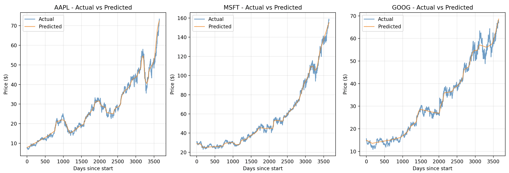
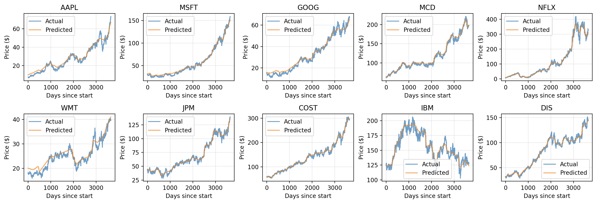

# nnstocks

nnstock is a small prototyped project for storing stock market trends using neural network compression. It showcases how a neural network can be used to store data efficiently, but with less resolution.

## Example

10 years (2010-2020) of daily price data for different stocks from the S&P500:

### Comparison and Storage

```
3 Stocks:
Torch model size on disk: 77.50 KB
Raw data size in memory: 176.91 KB
```



```
10 Stocks:
Torch model size on disk: 77.50 KB (same as 3)
Raw data size in memory: 589.69 KB
```



### Stats

| Ticker | Max % Error | Mean % Error | Median % Error |
| ------ | ----------- | ------------ | -------------- |
| AAPL   | 51.66       | 10.66        | 6.97           |
| MSFT   | 25.15       | 6.03         | 4.03           |
| GOOG   | 41.54       | 8.38         | 5.72           |
| MCD    | 14.05       | 2.87         | 2.49           |
| NFLX   | 76.50       | 9.88         | 6.08           |
| WMT    | 22.00       | 5.85         | 4.88           |
| JPM    | 28.13       | 4.00         | 2.87           |
| COST   | 18.85       | 2.95         | 2.49           |
| IBM    | 20.58       | 3.18         | 2.50           |
| DIS    | 20.71       | 3.35         | 2.76           |

### Query Time:

```
Model prediction time: 475.17 µs (CPU)
Raw data lookup time: 45.78 µs
```

The model lookup is much slower in this case, but could be signicantly improved with proper inference server.

## Requirements

PyTorch, yfinance, matplotlib, numpy, sklearn
